# pacman -S qemu virt-manager
    sudo usermod -a -G libvirt $(whoami)
    sudo vim /etc/libvirt/libvirtd.conf
        uncomment unix_sock_group = "libvirt"

# nat과 bridge연결을 위해
    pacman -S iptables-ntf, dnsmasq, bridge-utils

## 윈도우iso
[wind10](https://www.microsoft.com/ko-kr/software-download/windows10ISO)

## virtio 드라이버
[virtio driver](https://fedorapeople.org/groups/virt/virtio-win/direct-downloads/archive-virtio/)


## check hardware 
```
LC_ALL=C lscpu | grep Virtualization

#####   커널에서 kvm을 지원하는지 체크합니다.
lsmod | grep kvm

#####   virtio를 사용할 계획이므로, virtio도 확인합니다.
lsmod | grep virtio

####   만약 커널에 문제가 있다면
vi /etc/mkinitcpio.conf 
#   MODULES에
# kvmgt vfio vfio-iommu-type1 vfio-mdev virtio-net virtio-scsi virtio-serial virtio-balloon
#   를 추가해주고
sudo mkinitcpio -p linux

####    만약 인텔cpu라면
vi /etc/default/grub
#   에서 GRUB_CMDLINE_LINUX_DEFAULT의 끝에 intel_iommu=on을 추가합니다.

sudo reboot now

#다시 확인해봅니다.
```
## Creation of Windows 10 KVM VM
### Step 1 
    Open terminal and type virt-manager, 
        this would open up Linux Virtual machine manager. 
    Click on Create a New virtual machine button.
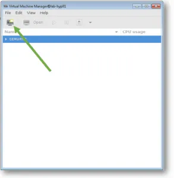

### Step 2 
    Select local install media and click forward.
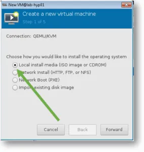

### Step 3
    You need to point the windows 10 ISO image 
        to the Virtualisation manager, 
    click on Browse.

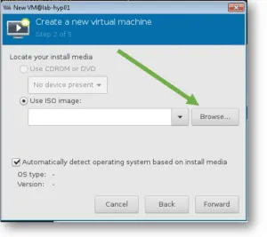

### Step 4
    Select Windows 10 iso image and click on open.

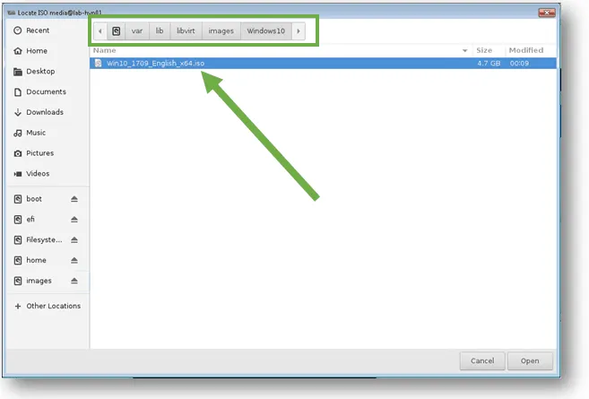

### Step 5
    Uncheck the option 
        Automatically detect operating system based on install media, 
    and select the OS type as Windows and Microsoft Windows 10 
    and click Forward.

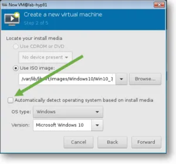

### Step 6
    You have to define the memory and CPU here, 
    I am assigning 8192 MB as the memory and 4 CPUs 
    and click Forward.
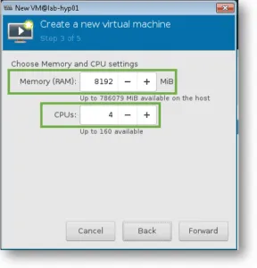

### Step 7
    For the storage, you may leave it as default 40 GB and click forward.
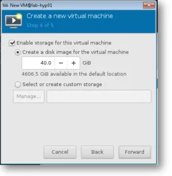
    
### Step 8
    Name your VM, 
    and check the option which says Customize configuration before install, 
    also select the network interface which you would like to use for your guest VM.
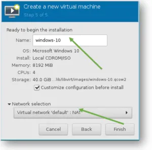

## Customizing the Hardware for Windows 10
### Step 1 
    Since we clicked on Customize hardware before install, 
    the KVM installation wizard would now open, 
    you need to change the disk storage type to VirtIO here.

    Select IDE Disk 1, 
    Click on expand Advanced options and 
    select VirtIO from the Disk bus 
    drop-down list and 
    click Apply.


### Step 2
    Click on CPU, 
    expand Topology and 
    check the option Manually 
    set CPU topology.

    By default the socket is picked up as 4, 
    let’s change that to 1 and 2 core and 2 Threads

    Note : 
    You may type the command 'virsh nodeinfo' in the terminal 
    to see your CPU and it’s socket information.

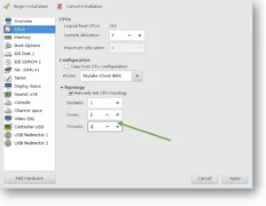

## Update the Virtual Network Interface
    Click on the NIC, 
    change the device model from Hypervisor default to virtio, 
    and click Apply.

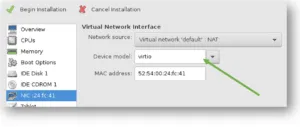

## Adding Windows 10 storage and hardware drivers for KVM
    We now need to attach the windows 10 iso image and virtio driver image that you had downloaded earlier in this lab. If you have not downloaded the windows virtio driver yet, please go ahead and download from 
[virtio-win.iso](https://fedorapeople.org/groups/virt/virtio-win/direct-downloads/archive-virtio/)
    
### Step 1
    To add windows 10 ISO image as CDROM. 
    Click on Add hardware.
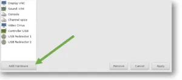

### Step 2
    Click on Storage, 
    Select Device type as CDROM device, and 
    click Finish.

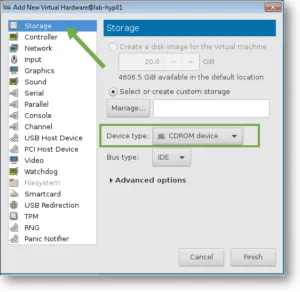

### Step 3
    Click on IDE CDROM1 
        that we just added and check the box Sharable and click on Connect.
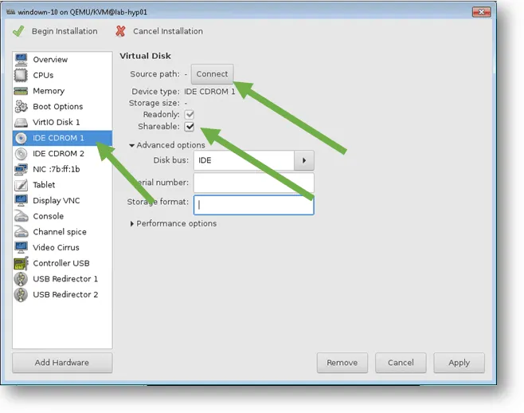
    On the prompt, you need to select the Windows 10 ISO image.
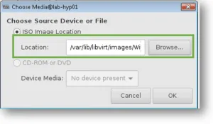
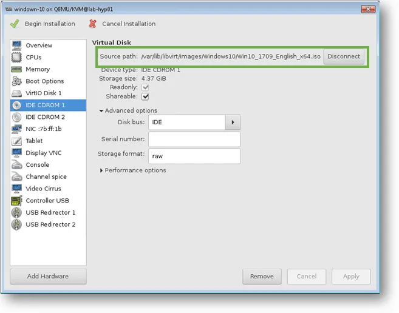

### Step 4 
    Attach the windows virtio drivers
    We have to attach the windows virtio driver 
    (This has all the KVM required drivers for windows machines) 
    that you have downloaded earlier. 
    Click on IDE CDROM 2, 
    Check the option sharable. 
    And click on Connect.

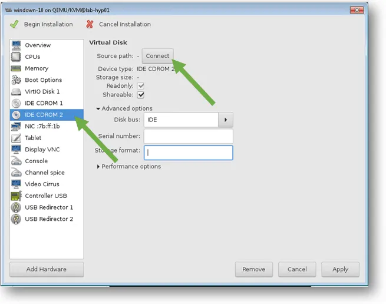
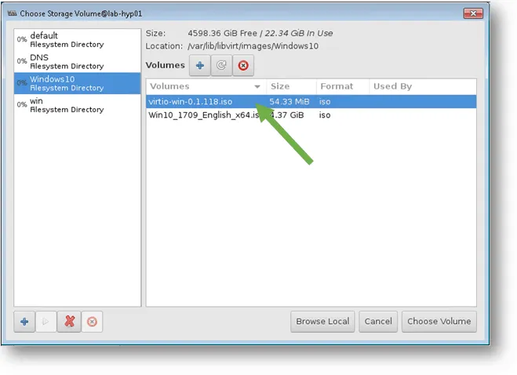

## Configure Boot device order for windows 10.
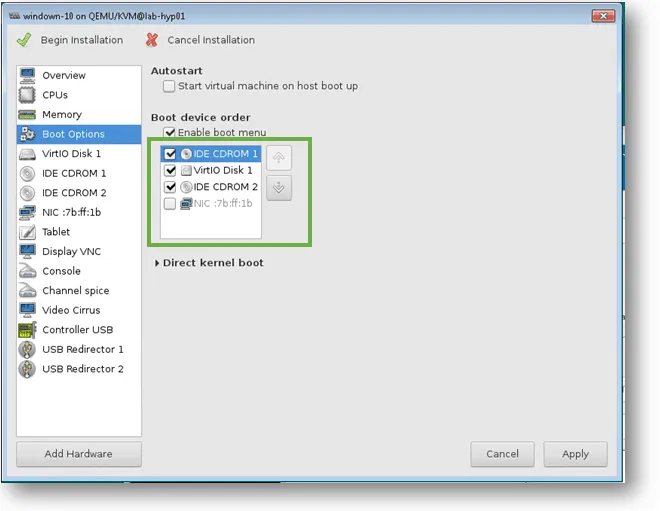

## Begin Windows 10 installation on KVM.

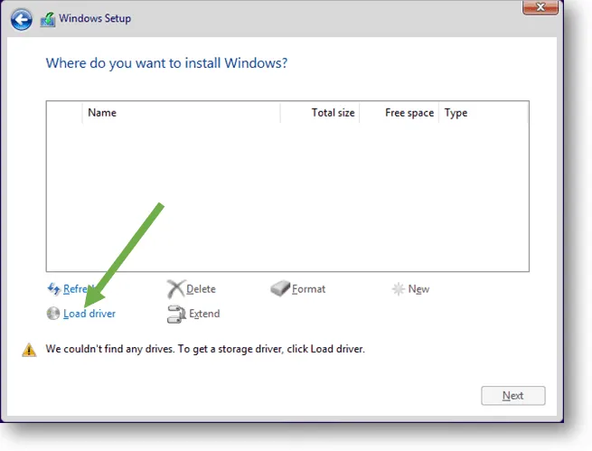
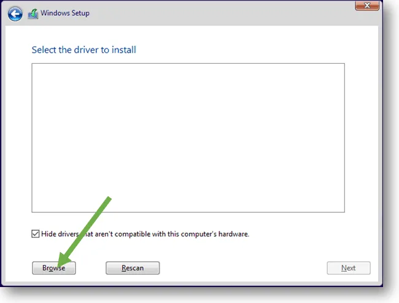


    Remember we had attached virtio driver as CDROM 2 during the VM setup, 
    In the CD Drive (E:) virtio-win-0.1.204.iso
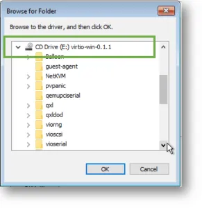

    Goto the location -> viostor/w10/amd64 click on Ok
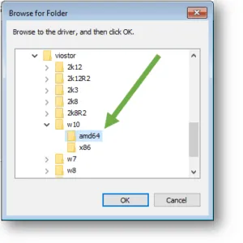
    Red Hat VirtIO SCSI controller select that

##  Install QEMU Window 10 virtio drivers
### Step 1 
    In the start menu, 
    type This PC and when you get the This PC icon, 
    right-click on it and 
    click on Manage. 
    This would open up the device manager.,0
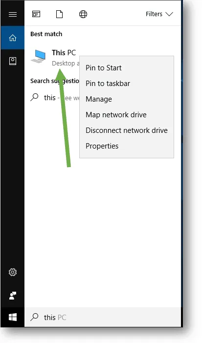
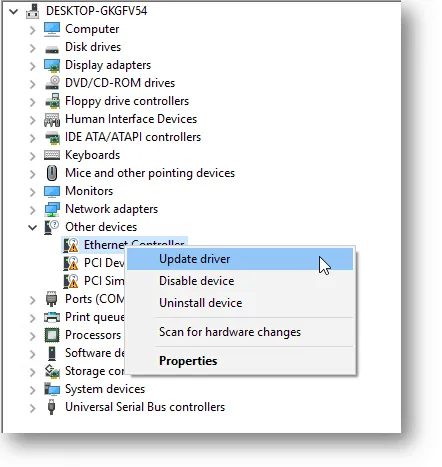

## Installation of KVM QXL display drivers for windows 10. 
### Step 1
    In windows 
    open the virtio CD drive and 
    go to the path \guest-agent\qemu-ga.msi 
    run the qemu-ga-x64. 
    Once the installation is complete 
    goto to the device manager again.

    And 
    click on Display adapters, 
    you can see its shows 
        Microsoft Basic Display adapter, 
    right-click on it and 
    update hardware. 

    And Just like how you updated the hardware for other devices, 
    install the display adapter from Redhat
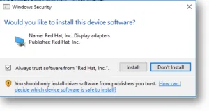
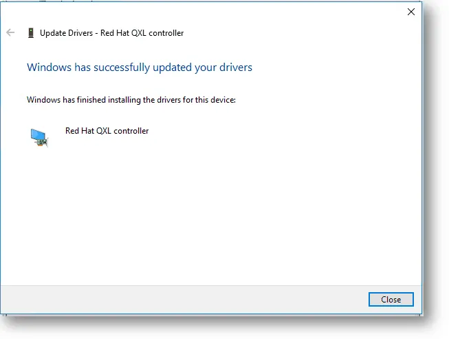
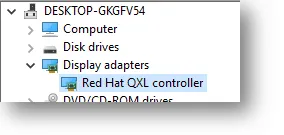

# If you wanted to access the VM on your Linux, 
## you can type 'virt-viewer' on the terminal. And 
    select the VM that we have installed and 
    you should be able to access the VM on your computer 
    similar to how you access a windows machine over RDP.

