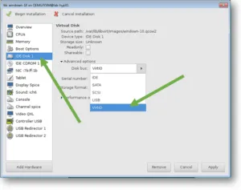

# virtio_win_driver
    https://fedorapeople.org/groups/virt/virtio-win/direct-downloads/archive-virtio/virtio-win-0.1.204-1/virtio-win.iso

# pacman -S qemu virt-manager
    sudo usermod -a -G libvirt $(whoami)
    sudo vim /etc/libvirt/libvirtd.conf
        uncomment unix_sock_group = "libvirt"

# nat과 bridge연결을 위해
    pacman -S iptables-ntf, dnsmasq, bridge-utils

    sudo virsh net-list --all
    sudo virsh net-start default
    sudo virsh net-autostart default

    sudo virsh net-audtostart br10 --disable
    sudo virsh net-destroy br10
    sudo virsh net-undefine br10

    sudo virsh dumpxml win10 | grep 'mac address'
    sudo virsh net-update default add ip-dhcp-host \
                "<host mac='xx:...' name=win10 ip=192.168.122.2' /> \
                --live --config

    sudo virsh domblklist win10
    sudo virsh change-media win10 sda --eject
    sudo virsh change-media win10 sda /pathto/img.iso --insert

    sudo virsh list --all
    sudo virsh start win10
    sudo virsh shutdown win10
    sudo virsh destroy win10 강제 종료
    sudo virsh reboot win10
    sudo virsh reset win10 (재시작)
    sudo virsh suspend win10
    sudo virsh resume win10

    sudo virsh autostart win10
    sudo virsh autostart win10 --disable

    sudo virsh snapshot-create-as win10 --name win10-snapshot-01
    sudo virsh snapshot-list win10
    sudo virsh snapshot-revert win10 --snapshotname win10-snapshot-01
    sudo virsh snapshot-delete win10 --snapshotname win10-snapshot-01


    sudo virsh undefine win10 (가상머신 삭제)

    sudo virsh edit win10

    cd ~/virtbackupdir
    touch win10.xml.bak
    sudo virsh dumpxml win10 > win10.xml.bak
    sudo cp /var/lib/libvirt/images/win10.qcouw2 /bacupdir

    sudo cp /backupdir/win10.qcow2 /var/lib/libvirt/images/win10.qcow2
    sudo virsh define --file /bak_dir/win10.xml.bak

    
## 윈도우iso
[wind10](https://www.microsoft.com/ko-kr/software-download/windows10ISO)

## virtio 드라이버
[virtio driver](https://fedorapeople.org/groups/virt/virtio-win/direct-downloads/archive-virtio/)

## bridge network
[ibm config file](https://www.ibm.com/docs/en/linux-on-systems?topic=choices-kvm-default-nat-based-networking)

    위 링크의 1번 과정인 
    Create a new libvirt network configuration like the following의 
        xml을 사실상 이름만 바꿔서 사용중입니다.

    sudo virsh net-define ./net-nat-network.xml
        으로 네트워크를 등록하고

    sudo virsh net-autostart netnat
        자동으로 실행되게 합니다.

    이제 윈도우vm을 설정할 때 네트워크에서 
    default대신 미리 생성한 네트워크를 이용합니다.

## check hardware 
```
LC_ALL=C lscpu | grep Virtualization

#####   커널에서 kvm을 지원하는지 체크합니다.
lsmod | grep kvm

#####   virtio를 사용할 계획이므로, virtio도 확인합니다.
lsmod | grep virtio

####   만약 커널에 문제가 있다면
vi /etc/mkinitcpio.conf 
#   MODULES에
# kvmgt vfio vfio-iommu-type1 vfio-mdev virtio-net virtio-scsi virtio-serial virtio-balloon
#   를 추가해주고
sudo mkinitcpio -p linux

####    만약 인텔cpu라면
vi /etc/default/grub
#   에서 GRUB_CMDLINE_LINUX_DEFAULT의 끝에 intel_iommu=on을 추가합니다.

sudo reboot now

#다시 확인해봅니다.
```
## Creation of Windows 10 KVM VM
### Step 1 
    Open terminal and type virt-manager, 
        this would open up Linux Virtual machine manager. 
    Click on Create a New virtual machine button.


### Step 2 
    Select local install media and click forward.


### Step 3
    You need to point the windows 10 ISO image 
        to the Virtualisation manager, 
    click on Browse.


### Step 4
    Select Windows 10 iso image and click on open.


### Step 5
    Uncheck the option 
        Automatically detect operating system based on install media, 
    and select the OS type as Windows and Microsoft Windows 10 
    and click Forward.


### Step 6
    You have to define the memory and CPU here, 
    I am assigning 8192 MB as the memory and 4 CPUs 
    and click Forward.


### Step 7
    For the storage, you may leave it as default 40 GB and click forward.

    
### Step 8
    Name your VM, 
    and check the option which says Customize configuration before install, 
    also select the network interface which you would like to use for your guest VM.


## Customizing the Hardware for Windows 10
### Step 1 
    Since we clicked on Customize hardware before install, 
    the KVM installation wizard would now open, 
    you need to change the disk storage type to VirtIO here.

    Select IDE Disk 1, 
    Click on expand Advanced options and 
    select VirtIO from the Disk bus 
    drop-down list and 
    click Apply.



### Step 2
    Click on CPU, 
    expand Topology and 
    check the option Manually 
    set CPU topology.

    By default the socket is picked up as 4, 
    let’s change that to 1 and 2 core and 2 Threads

    Note : 
    You may type the command 'virsh nodeinfo' in the terminal 
    to see your CPU and it’s socket information.


## Update the Virtual Network Interface
    Click on the NIC, 
    change the device model from Hypervisor default to virtio, 
    and click Apply.


## Adding Windows 10 storage and hardware drivers for KVM
    We now need to attach the windows 10 iso image and virtio driver image that you had downloaded earlier in this lab. If you have not downloaded the windows virtio driver yet, please go ahead and download from 
[virtio-win.iso](https://fedorapeople.org/groups/virt/virtio-win/direct-downloads/archive-virtio/)
    
### Step 1
    To add windows 10 ISO image as CDROM. 
    Click on Add hardware.


### Step 2
    Click on Storage, 
    Select Device type as CDROM device, and 
    click Finish.


### Step 3
    Click on IDE CDROM1 
        that we just added and check the box Sharable and click on Connect.

    On the prompt, you need to select the Windows 10 ISO image.


### Step 4 
    Attach the windows virtio drivers
    We have to attach the windows virtio driver 
    (This has all the KVM required drivers for windows machines) 
    that you have downloaded earlier. 
    Click on IDE CDROM 2, 
    Check the option sharable. 
    And click on Connect.


## Configure Boot device order for windows 10.


## Begin Windows 10 installation on KVM.


    Remember we had attached virtio driver as CDROM 2 during the VM setup, 
    In the CD Drive (E:) virtio-win-0.1.204.iso


    Goto the location -> viostor/w10/amd64 click on Ok

    Red Hat VirtIO SCSI controller select that

##  Install QEMU Window 10 virtio drivers
### Step 1 
    In the start menu, 
    type This PC and when you get the This PC icon, 
    right-click on it and 
    click on Manage. 
    This would open up the device manager.,0


## Installation of KVM QXL display drivers for windows 10. 
### Step 1
    In windows 
    open the virtio CD drive and 
    go to the path \guest-agent\qemu-ga.msi 
    run the qemu-ga-x64. 
    Once the installation is complete 
    goto to the device manager again.

    And 
    click on Display adapters, 
    you can see its shows 
        Microsoft Basic Display adapter, 
    right-click on it and 
    update hardware. 

    And Just like how you updated the hardware for other devices, 
    install the display adapter from Redhat


# If you wanted to access the VM on your Linux, 
## you can type 'virt-viewer' on the terminal. And 
    select the VM that we have installed and 
    you should be able to access the VM on your computer 
    similar to how you access a windows machine over RDP.

# 공유 폴더
    spice의 webdav를 이용하였으며,
    https://dausruddin.com/how-to-enable-clipboard-and-folder-sharing-in-qemu-kvm-on-windows-guest/

    이 글에 따르면, 
    virt-manager는 
        spice의 webdav기능을 지원하지 않는다고 합니다.

    따라서 추가로 cockpit을 사용합니다.

    yay virt-viewer
    yay cockpit

    윈도우vm을 실행한 다음,
    https://www.spice-space.org/download/windows/spice-webdavd/
    spice webdav를 설치합니다.

    virt-manager에서 vm설정으로 진입하여,
    다음과 같이 채널을 추가합니다.


    cockpit 서비스를 등록합니다.

### 등록 방법
    https://cockpit-project.org/running

        cockpit을 실행합니다.
    sudo systemctl start cockpit

    이제 다음 주소로 cockpit에 접근 가능합니다.
    http://localhost:9090
    계정 정보는 리눅스 사용자 정보와 같습니다.
    저는 webapp-manager에 등록후 사용중입니다.


    좌측 메뉴의 가상머신에 들어가면 기존에 설치한 윈도우가 있습니다.
    실행 후
    원격 뷰어 시작을 누릅니다.
    virt-viewer를 설치했다면,
    그냥 열면 바로 실행됩니다.(firefox)
    파일 > preferences를 선택하면


    share folder를 체크하고
    경로를 설정해줍니다.

    그리고 윈도우vm에 들어가서
    services.msc
        을 실행한 다음

    Spice webdav proxy
        를 시작하시면 정상적으로 연결된 모습을 확인할 수 있습니다.

    다음과 같이 연결된 모습을 확인할 수 있습니다.


    
